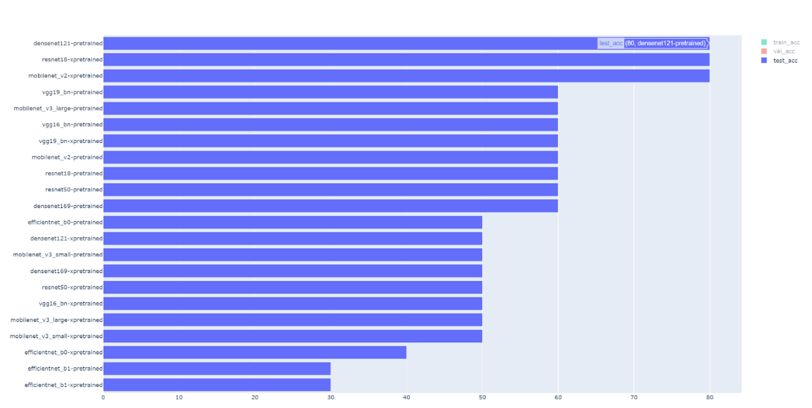
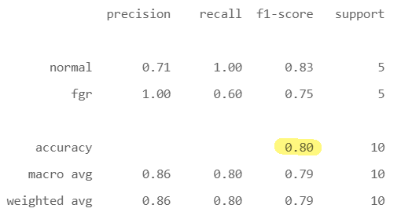
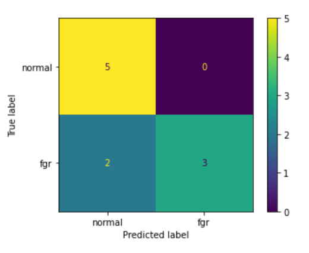
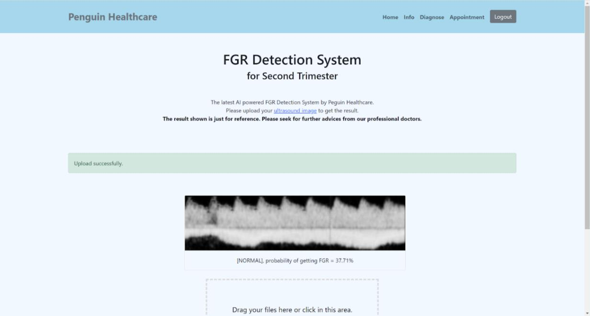

# Fetal Growth Restriction Detection System for Second Trimester of Pregnancy

## Aim

Develop a system that able to detect FGR in the second trimester of pregnancy that using only uterine arterial Doppler waveform image.

## Objectives

1. Develop a model to detect FGR using features extracted from Doppler ultrasound waveform image.
1. To measure and evaluate the performance of the models for FGR detection.
1. To develop informative and user-friendly graphic user interface for the system.

## Requirements

> pip install -r requirements.txt

## Files

- `main.py` to run whole system.
- `preprocess_image.py` to preprocess raw data.
- `plot.py` to visualize the performance of models.
- `plot_cv.py` to visualize the performance of models for cross-validation.
- `notebook/notebook.ipynb` to run whole workflow of model training.
- `notebook/notebook-cv.ipynb` to run whole workflow of model training for cross-validation.

## Model weights

- [Densenet121](https://drive.google.com/file/d/1gMfEDtjxtKI0CZNmoXccRJv2VPwnu5AH/view?usp=sharing)

## Results

**Test Result**
 

 
 
**Classification Report**
 

 
 
**Confusion Matrix**
 

 
 

## Screenshots

**Home Page**
 

 
 
**Inference Page**
 

